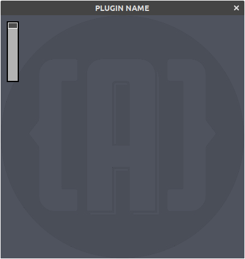

# DPF Template for Audio FX


## Cloning this repository

THe DPF framework is a submodule for this repo.  
Clone with :  
`git clone --recursive https://github.com/rghvdberg/dpf_templates.git`

---

### Build System

DPF uses `make` to build the plugins.  
We need a certain directory tree in order to build DPF plugins

```
.
├── dpf
├── plugins
│   └── PLUGIN_NAME
│       ├── Makefile
└── Makefile
```

You can build several plugins in the `plugins` directory

The `Makefile` in the root directory builds DPF and the plugins.  
Only thing you edit are :  
~ @ line 18  
 `$(MAKE) all -C plugins/PLUGIN_NAME`
and  
~ @ line 38  
`$(MAKE) clean -C plugins/template_dpf_fx`

Each plugin directory needs a Makefile too.  
There you define the binary name and which files to build for DSP and UI.  
Look at lines 10 to 20 in `plugins/template_dpf_fx/Makefile`

```Makefile
NAME = template_fx
FILES_DSP = \
        Plugin.cpp

FILES_UI  = \
        UI.cpp
```

---

### Plugin Macros

Each plugin directory needs a `DistrhoPluginInfo.h` in which we define several macros.  
These macros setup the plugin brand, name, inputs, outputs etc.  
In this template plugin these macros are set:

```c++
#define DISTRHO_PLUGIN_BRAND "BRAND NAME"
#define DISTRHO_PLUGIN_NAME "PLUGIN NAME"
#define DISTRHO_PLUGIN_URI "http://example.org/PLUGIN_NAME"
#define DISTRHO_PLUGIN_HAS_UI 1
#define DISTRHO_PLUGIN_IS_RT_SAFE 1
#define DISTRHO_PLUGIN_NUM_INPUTS 2 // audio inputs
#define DISTRHO_PLUGIN_NUM_OUTPUTS 2 // audio outputs
```

Have a look at <https://distrho.github.io/DPF/group__PluginMacros.html> for further info about these macros.

---

### Parameters

For convenience we define the parameters as an `enum` in `DistrhoPluginInfo.h` and include this file in both the plugin and ui code.

```c++
enum Parameters
{
    kGain = 0,
    kParameterCount
};
```
---

### Plugin Code

DPF plugins have separated dsp and ui code.
Let's look at the dsp code. Usually this is called simply `Plugin`.

The plugin code is in `plugins/template_dpf_fx/Template_DPF_FX_Plugin.cpp` and is (I think) well documented.  

Here's a quick overview

Our plugin subclasses `Plugin` which takes 3 parameters:  

+ parameter count
+ program count
+ states count

_Note: We have 1 parameter in our case and we use the `kParameterCount` for that._

---
## Info

There are several functions returning plugin info:

+ `getLabel()`
+ `getDescription()`
+ `getMaker()`
+ `getHomePage()`  
+ `getLicense()` 
+ `getVersion()`
+ `getUniqueId()`

Edit the return values to your needs.  

---

## Internal data (parameters)

+ `initParameter()` is called for each parameter.
We use a switch statement to return the parameter properties.  
We can define a number of properties.
All parameters are implemented as `float`. However, you can set properties for the parameter to be interpreted as integers or enums.  
Check out <https://distrho.github.io/DPF/structParameter.html> for further info.

+ `getParameterValue()` is where you return a value of a parameter, in our case the `kGain` index is bound to the variable `fGain`.

+ `setParameterValue()` is called by the **host** if a parameter is changed.  
**Note: the plugin itself can not change it's parameters.**

---

## Process

In the `run()` function we process our audio and midi data.  
There are several overloaded functions for `run()` and which one you need depends on the macros you've enabled in `DistrhoPluginInfo.h`.  
As we've defined 2 audio inputs and 2 audio outputs in the macros we use :  

```c++
run(const float** inputs, float** outputs, uint32_t frames)
```

`input[0]` and `input[1]` hold the buffer for incoming audio (left and right channel) , same for `output[0] and output[1]` for the outgoing audio.  
The size of the audio buffers is `frames`.  
For convenience let's define some buffers.

```c++
float *outLeft = outputs[0];
float *outRight = outputs[1];
const float *inLeft = inputs[0];
const float *InRight = inputs[1];
```

We loop over the buffer to process our incoming audio.  

```c++
for (uint32_t i = 0; i < frames; ++i)
  {
    outLeft[i] = inLeft[i] * fGain;
    outRight[i] = InRight[i] * fGain;
  }
```

That basically wraps up the Plugin side of a DPF plugin.

---

### Graphical User Interace

Our UI is in `plugins/template_dpf_fx/Template_DPF_FX_UI.cpp`.  
It consists of a simple window with a background and one slider.  


DPF can use several toolkits to implement a GUI.  
For this template we use the basic built-in toolkit called DGL.  

First we include headers for the UI and widgets.

```c++
#include "DistrhoUI.hpp"
#include "ImageWidgets.hpp"
```

Our plugin UI class, subclasses from `UI` and `ImageSlider::Callback`.  
In the constructor we set the UI size `UI(400,400)`

First let's take a look at our variables in  `private:`

+ `fGain` holds the value of our parameter.
+ `fSliderGain` is our slider widget.
+ `sliderBack` : the slider widget only draws the handle of the slider so we need to create an image for the background of the slider.
+ `background` is the background image of our plugin window.
  
---

#### Creating images

We compile our images in the plugin.  
There's a handy utility `dpf/utils/png2rgba.py`

```bash
$ ./dpf/utils/png2rgba.py
Usage: ./dpf/utils/png2rgba.py <namespace> <artwork-folder>  
```

We put our images in the Artwork directory and run the script from our plugin directory.  

```bash
../../dpf/utils/png2rgba.py Artwork Artwork
```

This creates `Artwork.cpp` and `Artwork.hpp`.  
We include the header in our UI code.  
`#include "Artwork.hpp"`

---

Now we have everything in place the setup our slider in the constructor.

```c++
  fSliderGain = new ImageSlider(this, Image(Artwork::slider_handleData, Artwork::slider_handleWidth, Artwork::slider_handleHeight, GL_BGRA));
  fSliderGain->setId(0);
  fSliderGain->setDefault(1.0f);
  fSliderGain->setRange(0.0f, 1.0f);
  fSliderGain->setHeight(Artwork::slider_backHeight);
  fSliderGain->setWidth(Artwork::slider_backWidth);
  fSliderGain->setStartPos(Point<int>(12, 12));
  fSliderGain->setEndPos(Point<int>(12, 98));
  fSliderGain->setValue(1.0f);
  fSliderGain->setInverted(true);
  fSliderGain->setCallback(this);
```
  
 **Note: remember that the ImageSlider only draw the slider handle.**  

We have inherited `ImageSlider::Callback` so let's implement the callback functions.
  
+ `imageSliderValueChanged()` gets the value and we use `setParameterValue()` to notify the host that the value has changed. (and in turn, the host notifies the DSP code).  
  
+ `imageSliderDragStarted()` and `imageSliderDragFinished()` notify the host that we are dragging the sliders.  

---

### Rendering the UI

+ onDisplay()  

Here we paint the background and the slider background.  
The slider handle is painted by the imageSlider widget.

---

### Building
make sure that the cpp files are in `plugins/template_dpf_fx/Makefile`

```Makefile
FILES_DSP = \
	Template_DPF_FX_Plugin.cpp

FILES_UI  = \
	Template_DPF_FX_UI.cpp \
	Artwork.cpp
```

and from our base directory we type `make`  
The build system will create a `bin` directory and place our binaries in there.  
There's no make install, just copy the binaries to the appropiate place in your pc.  
On linux you'll typically want the lv2 bundle in `~/.lv2` and vst in `~/.vst`.  

+ If you have the jack audio headers installed a jack binary will also be compiled, this is handy for debugging but can't really be recommended as a true 'app'.
+ If you need a debug build, do `make DEBUG=true`


